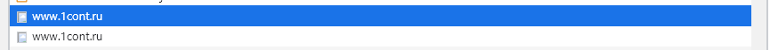
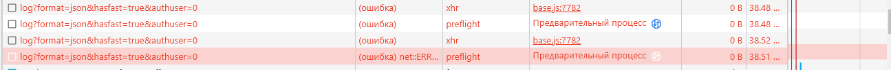
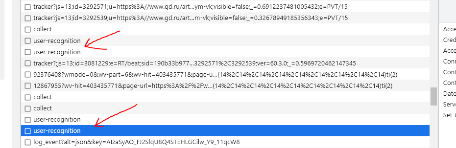
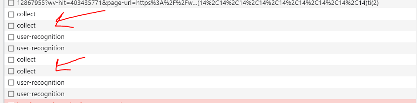
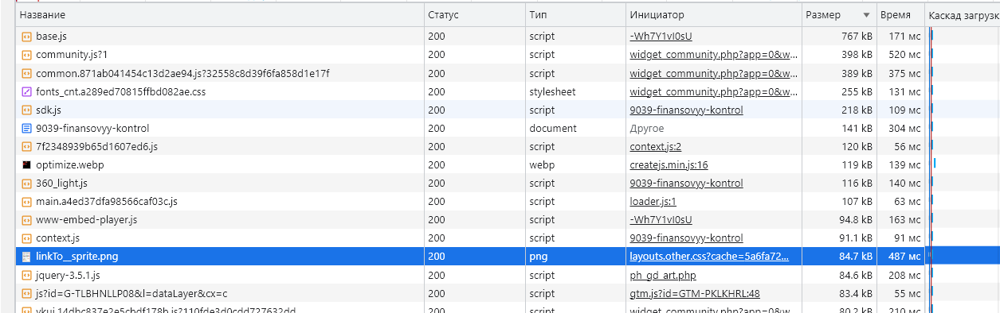
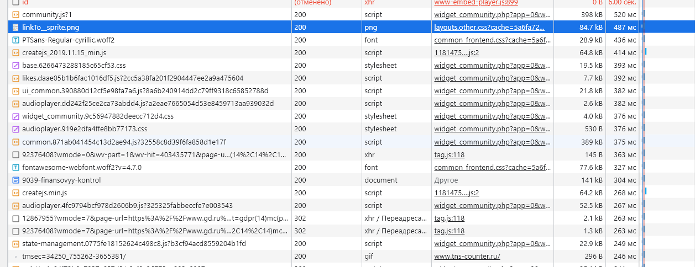

- __1 Дублированные запросы:__
    1 
    2 Тут возможно идёт повторение потому, что первый раз пришла ошибка 
    3 После этих двух потом идёт ещё множество идентичных запросов и все в паре 
    4 Тут также, как и прошлом пункте 
    5 Как в пункте 2, повторный запрос после ошибки 

- __2 Лишний размер:__
    1 Не особо понятно, как отличить лишний размер от не лишнего, но вот самые большие по объёму запросы

- __3 Медленная загрузка:__
    1 Все основные долго загружающиеся ресурсы, не считая тех, что пришли с ошибкой

- __4 Блокирующие загрузку:__
    1 