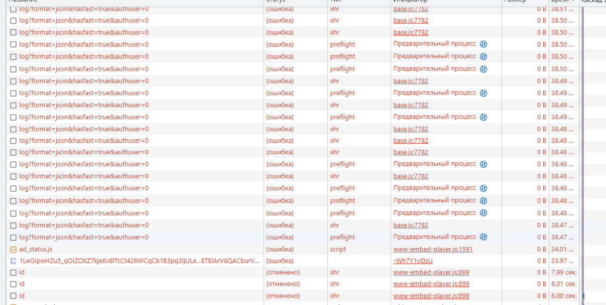

- 1. Дублированные запросы:
    1. 
    2. Тут возможно идёт повторение потому, что первый раз пришла ошибка 
    3. После этих двух потом идёт ещё множество идентичных запросов и все в паре 
    4. Тут также, как и прошлом пункте 
    5. Как в пункте 2, повторный запрос после ошибки 

- 2. Лишний размер:
    1. Не особо понятно, как отличить лишний размер от не лишнего, но вот самые большие по объёму запросы

- 3. Медленная загрузка:
    1. Все основные долго загружающиеся ресурсы, не считая тех, что пришли с ошибкой

- 4. Блокирующие загрузку:
    1. 